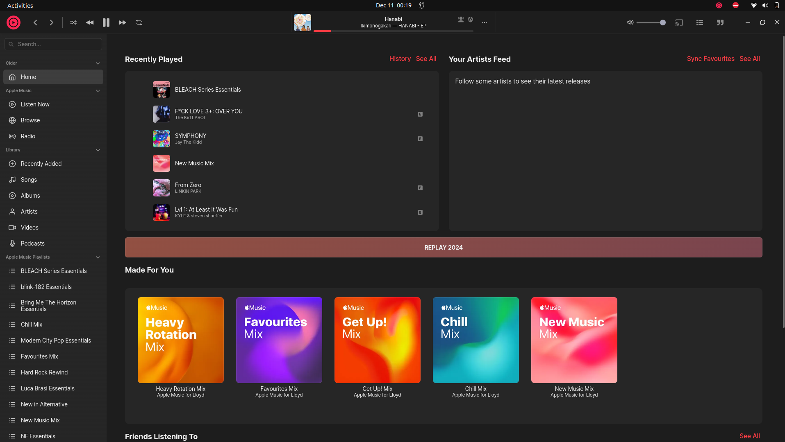

# *My favourite music player is broken?* Lets fix it.

[Quick link to patched Cider for Linux.](https://github.com/Aegizz/CiderArchiveFork)

If you do not know my personally, I have a confession. I use Apple Music. I know, I know it sucks but, [Cider](https://cider.sh/) is a great alternative. It has integration with Discord, and a great UI overhaul. Recently, I wanted to install this great application on my Ubuntu laptop after finally deleting my Windows dual-boot.



To my dismay when I went to compile the application from their archived source repository here: [Cider V1](https://github.com/ciderapp/Cider), it failed.

The simplist decision would probably be just to switch to Spotify like a normal person or install iTunes through Wine, but respectively iTunes is pretty trash. Their new and updated applications on modern iOS and MacOS devices are great, but the last time I used it on Windows it was severly outdated, buggy, and slow.

Hmmm, actually this bug actually looks fixable. 


```
src/main/base/browserwindow.ts:1303:33 - error TS2769: No overload matches this call.
  The last overload gave the following error.
    Argument of type 'Int8Array<any>' is not assignable to parameter of type 'WithImplicitCoercion<string> | { [Symbol.toPrimitive](hint: "string"): string; }'.
      Type 'Int8Array<any>' is not assignable to type '{ valueOf(): string; }'.
        The types returned by 'valueOf()' are incompatible between these types.
          Type 'Int8Array<any>' is not assignable to type 'string'.

1303       let pcmData = Buffer.from(new Int8Array(interleave16(bitratechange(Int16Array.from(newaudio[0], (x) => convert(x))), bitratechange(Int16Array.from(newaudio[1], (x) => convert(x)))).buffer));
                                     ~~~~~~~~~~~~~~~~~~~~~~~~~~~~~~~~~~~~~~~~~~~~~~~~~~~~~~~~~~~~~~~~~~~~~~~~~~~~~~~~~~~~~~~~~~~~~~~~~~~~~~~~~~~~~~~~~~~~~~~~~~~~~~~~~~~~~~~~~~~~~~~~~~~~~~~~~~~~~~~~~~

  node_modules/@types/node/buffer.buffer.d.ts:87:13
     87             from(
                    ~~~~~
     88                 str:
        ~~~~~~~~~~~~~~~~~~~~
    ... 
     93                 encoding?: BufferEncoding,
        ~~~~~~~~~~~~~~~~~~~~~~~~~~~~~~~~~~~~~~~~~~
     94             ): Buffer<ArrayBuffer>;
        ~~~~~~~~~~~~~~~~~~~~~~~~~~~~~~~~~~~
    The last overload is declared here.

src/main/plugins/raop.ts:329:62 - error TS2769: No overload matches this call.
  The last overload gave the following error.
    Argument of type 'Int8Array<ArrayBuffer>' is not assignable to parameter of type 'WithImplicitCoercion<string> | { [Symbol.toPrimitive](hint: "string"): string; }'.
      Type 'Int8Array<ArrayBuffer>' is not assignable to type '{ valueOf(): string; }'.
        The types returned by 'valueOf()' are incompatible between these types.
          Type 'Int8Array<ArrayBuffer>' is not assignable to type 'string'.

329               this.airtunes.circularBuffer.write(Buffer.from(Int8Array.from(result.outbuffer)));
                                                                 ~~~~~~~~~~~~~~~~~~~~~~~~~~~~~~~~

  node_modules/@types/node/buffer.buffer.d.ts:87:13
     87             from(
                    ~~~~~
     88                 str:
        ~~~~~~~~~~~~~~~~~~~~
    ... 
     93                 encoding?: BufferEncoding,
        ~~~~~~~~~~~~~~~~~~~~~~~~~~~~~~~~~~~~~~~~~~
     94             ): Buffer<ArrayBuffer>;
        ~~~~~~~~~~~~~~~~~~~~~~~~~~~~~~~~~~~
    The last overload is declared here.


Found 2 errors in 2 files.

Errors  Files
     1  src/main/base/browserwindow.ts:1303
     1  src/main/plugins/raop.ts:329
```
We've got two programming errors here, both seem to have the same issue. Likely from the same developer, looking at you 0.1x engineer. In all honesty, the problems are probably just from a package updating itself and breaking old code. Classic Javascript/Typescript.

So lets analyse these lines critically and breakdown what is actually happening here.

browserwindow.ts:1303:33

Argument of type 'Int8Array\<any\>' is not assignable to parameter of type 'WithImplicitCoercion\<string\>'

```js
let pcmData = Buffer.from(new Int8Array(interleave16(bitratechange(Int16Array.from(newaudio[0], (x) => convert(x))), bitratechange(Int16Array.from(newaudio[1], (x) => convert(x)))).buffer));
```

So this buffer function is complaining that it is recieving a Int8Array\<any\> object, and not a WithImplicitCoercion\<string\>. The problem is that this new Int8Array is being passed to the function. This causes a type error because we need to pass the ArrayBuffer directly to the function [Buffer.from - Node Docs](https://docs.deno.com/api/node/buffer/~/BufferConstructor.from). This is an easy fix and is actually as simple as moving/adding .buffer to the end of the object to pass the ArrayBuffer instead.

Fix:
```js
let pcmData = Buffer.from(interleave16(bitratechange(Int16Array.from(newaudio[0], (x) => convert(x))), bitratechange(Int16Array.from(newaudio[1], (x) => convert(x)))).buffer);
```

```js
this.airtunes.circularBuffer.write(Buffer.from(Int8Array.from(result.outbuffer).buffer));
```


It compiles! Wow, I would make a PR but it the repo is archived so I [forked](https://github.com/Aegizz/CiderArchiveFork) it and pushed my changes. Hopefully this helps anyone else who wants to use this software.