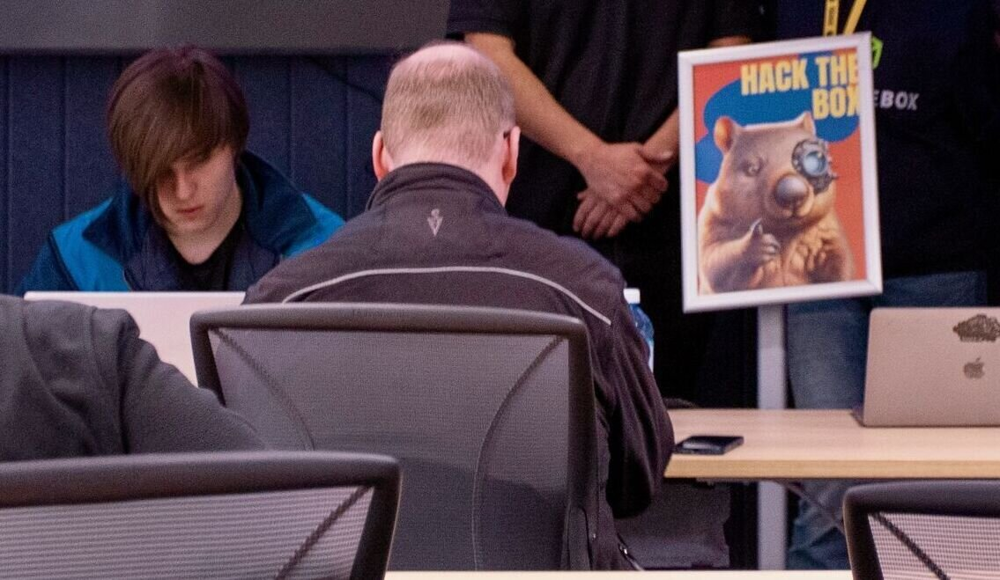
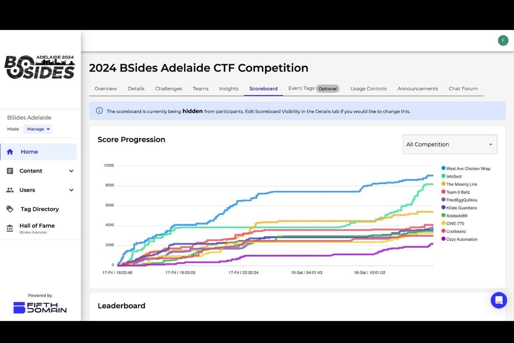

# Adelaide BSides CTF

### Event

On the 17th of May to the 19th, BSides was coming to Adelaide. And with BSides, comes a CTF.

After asking around a few friends seemed interested, so we formed a team. [Kei](https://www.linkedin.com/in/sheryl-l2022/), [Will](https://www.linkedin.com/in/willjjohnston/) and [Bailey](https://www.linkedin.com/in/bayleyfoster).

We entered under Kei's and I's old Valorant team name `O'ballz`.

After a few days work, mostly spent completing challenges and exploring the stalls and events going on, we managed to secure 4th!

A little bit disapointed we missed out on a prize by one position, but if you look at the graph the top 3 teams outclassed pretty much everyone.

Still excited for such an awesome experience!
