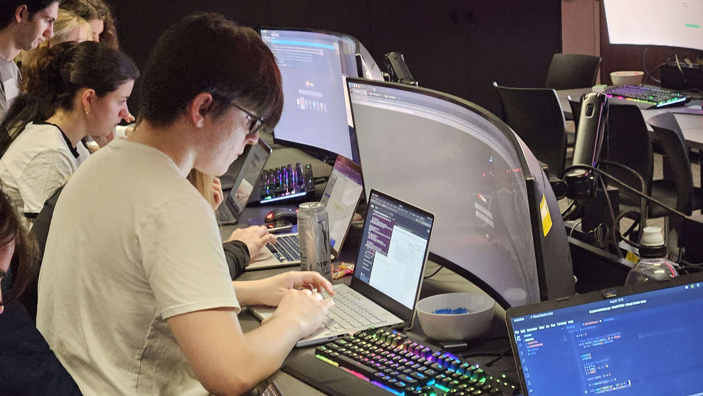

<body>

    <a id="a-title" href="/">
    <h1>About Me</h1>
    </a>
    
    <section id="Profiles">
    <a href="https://github.com/Aegizz" class="btn btn-github">View me on GitHub</a>
    <a href="https://www.linkedin.com/in/lloyd-draysey-618647187/" class="btn btn-linkedin">View me on LinkedIn</a>
    <a href="https://twitter.com/AegizzR6" class="btn btn-twitter">View me on Twitter</a>
    </section>
    
Hi! My name is Lloyd, but I sometimes go by Aegizz. I am third year Computer Science student at The University of Adelaide with a major in Cybersecuritry.

    <section id="main_content">

    <h1 id="this-is-a-personal-blog-to-record-my-cybersecurity-and-programming-experiences">Welcome to my blog!</h1>
    
This is where I plan to put all my CTFs, coding competitions, side projects and interesting experiences.

    </section>

</body>